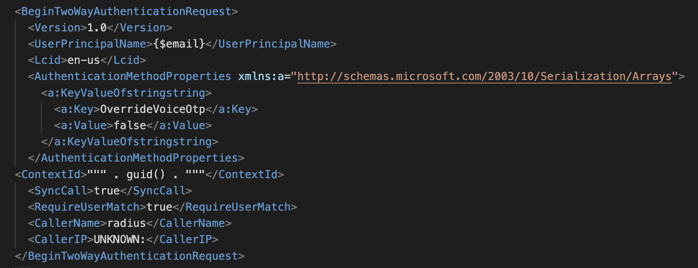
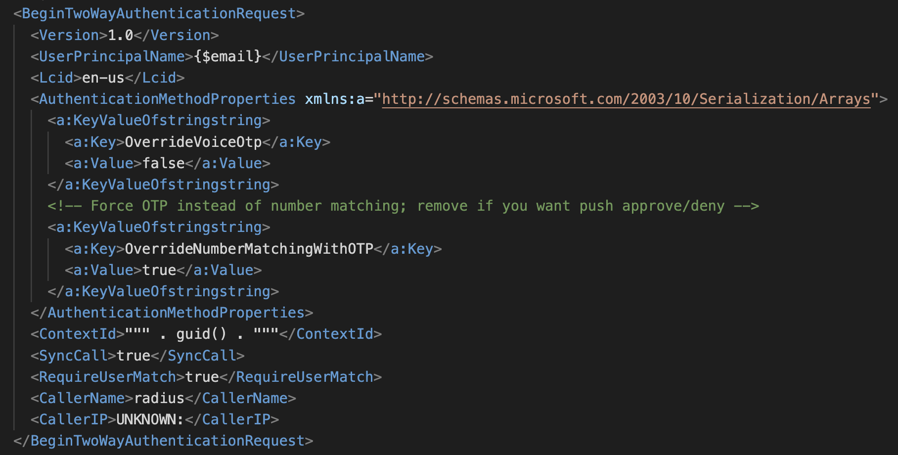

<<<<<<< HEAD
# MS_MFA
=======
# 🚀 MS_MFA

Direct invocation of Microsoft MFA application, with push notification or TOTP verification.

[](#) 
[](#license)
[](#)

---

## 📚 Table of Contents
- [Features](#-features)
- [Two Options Only](#%EF%B8%8F-two-options-onlys)
- [How Does It Work](#-how-does-it-work)
- [Links](#-links)

---

## ✨ Features
- ✅ Easy to install and run
- ⚡ Unofficial: used with the same config on all MS tenant, yet unofficial
- 🔒 Built-in security: no parameters to be sanitized, no customization

---

## 🖼️ Two Options only
<h1>> pushPopup</h1>

This option is to raise a popup on Authenticator app of the smartphone where the user is configured.

In detail, this part of the configuration is the one responsible for this behaviour, as said by the [Full Story].

Code snippet:
```bash
    <a:KeyValueOfstringstring>
      <a:Key>OverrideVoiceOtp</a:Key>
      <a:Value>false</a:Value>
    </a:KeyValueOfstringstring>
```

Out of the full XML configuration:
<p align="center">
  
</p>

Sometimes, to be better investigated, this option does not popup on Authenticator, and the returned value is 'challenge'.

This means that the operation of MFA could not be completed, and it has to fallback on next option, which is checking the correctness of the TOTP associated to the entry on Authenticator.  Whilst the next method works in every circumstance, the initial one sometimes fail.

<h1>> checkTOTP</h1>
This option is intended to check the correctness of the TOTP, to be inserted in a webpage as an example.

In detail, this part of the configuration is the one responsible for this behaviour, and this is an original contribution.

Code snippet:
```bash
    <a:KeyValueOfstringstring>
      <a:Key>OverrideNumberMatchingWithOTP</a:Key>
      <a:Value>true</a:Value>
    </a:KeyValueOfstringstring>
```

Out of the full XML configuration:
<p align="center">
  
</p>


---

## 🧩 How Does It Work
There is a powershell script, named 
- Node.js >= 18 **or** Python >= 3.11
- Git
- (Optional) Docker

Check versions:
```bash
node -v
python --version
```

---

## Links
Full story [online](https://www.entraneer.com/blog/entra/authentication/transactional-mfa-entra-id) and [locally](docs/fullStory.pdf)
>>>>>>> 03f37ae (first)
